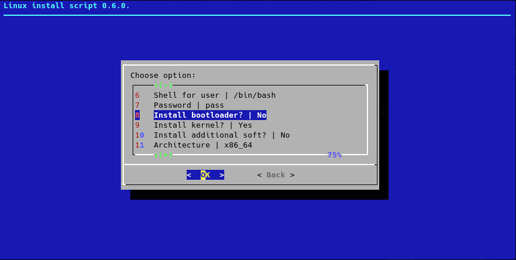

linux_install
=============

[](https://github.com/alealexpro100/linux_install/releases/latest)
[](LICENSE)
[](https://github.com/alealexpro100/linux_install/commits)
[](https://github.com/alealexpro100/linux_install/commits)
[](https://github.com/alealexpro100/linux_install/releases/latest)

## Preview



## TL;DR

One of _base_ features of this project is usage of __auto-profiles__:

```bash
add_var "declare -gx" "dir" "${default_dir:-/mnt/mnt}"
add_var "declare -gx" "distr" "alpine"
add_var "declare -gx" "hostname" "$distr"
add_var "declare -gx" "user_name" "$user_name"
add_var "declare -gx" "user_shell" "$user_shell"
add_var "declare -gx" "passwd" "$passwd_default"
add_var "declare -gx" "arch" "x86_64"
add_var "declare -gx" "mirror_alpine" "$mirror_alpine"
add_var "declare -gx" "version_alpine" "edge"
```

Just run `./install_sys.sh <path_to_profile>` and all work will be done.

This is minimal working auto-installation profile. It installs Alpine rootfs and configures it: adds user, setup hostname, set correct mirror.

## About

Supported features table:

|Feature          | Auto-mode | Manual-mode|
|-----------------|:---------:|:----------:|
|Offline install  | WIP       | No         |
|Online install   | Yes       | Yes        |
|Localization     | Yes       | Yes        |
|User scripts     | Yes       | No         |

This script installs a base linux system from any linux distribution.
Connection to mirror with packages for installing distribution is required.
Tested on Alpinelinux (musl) and Archlinux (glibc).
Supported Linux distros for installation:

1. Alpine
2. Archlinux
3. Astra
4. Debian
5. Voidlinux

Alternatives:

* For cloud-based linux instance, consider using [cloud-init](https://cloud-init.io/).
* Enterprise solution for installing on many PCs, consider using [FAI](https://fai-project.org/).

Differences:

* From [FAI](https://fai-project.org/): Uses only chosen mirror, has less size of live images (1GB vs 170MB).
* Distro-specific installer: Support variety of distribution, requires connection to mirror with packages.

See presentation of this project [here](https://mirror.alexpro100.ru/scripts_files/other/presentations/Linux_install.pdf) (Russian).

> Project is actively developed and it is ready to be used in a production environment

## Dependencies

### Requried

* `coreutils util-linux bash wget tar zstd` - For normal system
* `busybox bash zstd findmnt lsblk` - For busybox system (ex. Alpine)

### Optional

* `perl dpkg` - debootstrap
* `rpm2cpio` - rpm-bootstrap
* `qemu-user-static` - foreign architectures

### Build

* `git squashfs-tools xorriso p7zip-full wget` - live installer build (ubuntu)

## Usage

### Live installer

#### Manual mode

##### From ISO

* Download latest `linux_install-*.iso` file from [releases](https://github.com/alealexpro100/linux_install/releases).
* Boot from it. UEFI and BIOS systems are supported.
* Follow install instructions.
* That's all. You have installed system. Good luck!

##### From PXE (IPXE)

* Download latest `linux_install-*.pxe.tar.gz` file from [releases](https://github.com/alealexpro100/linux_install/releases).
* Unpack it to boot server. Variable `${linux_url}` is a url to directory with needed files.
* To boot it from [IPXE](https://ipxe.org/) there is two necessary kernel options: `modloop=${linux_url}/modloop-lts rootfs_net=${linux_url}/rootfs.img`.
* Follow install instructions.
* That's all. You have installed system. Good luck!

#### Auto mode (PXE)

* Prepare auto live profile. (Build profile described [here](docs/auto_configs.md))
* You will need add kernel option `AUTO_PROFILE=URL_TO_YOUR_PROFILE`. Examples: `AUTO_PROFILE=/auto_configs/live/example_auto_profile.sh` OR `AUTO_PROFILE=https://example.com/auto_profile.sh`.
* Installation will start and complete itself.

### Standalone

#### Manual mode

* Prepare directory for installation.
* Clone this repo.
* Execute `./profile_gen.sh` and answer questions OR use one of prepared in `./auto_configs`.
* Execute `./install_sys.sh your/profile.sh` using installation profile to install system.
* That's all. You have installed system. Good luck!

#### Auto mode

[In TL;DR](#tldr)

## Building

* Clone this repo: `git clone https://github.com/alealexpro100/linux_install`.
* Change location of ALPINE_FILES in `./bin/make_images/build.sh`. Some variables can be changed without changing file.
* Run it from **root**: `sudo ./bin/make_images/build.sh`.
* Images will be located at directory `./linux_install_builds`.

## Supported variables

* `AUTO_PROFILE` - Kernel option for live installer. URL of profile for auto mode.
* `REBOOT_AFTER` - Used for auto mode. If set to `0`, prevents system from rebooting after installation.
* `CUSTOM_DIR` - Path to custom script and files.
* `ECHO_MODE` - Mode of interface (auto/cli/dialog).
* `LANG_INSTALLER` - Language for install interface. (NOT of target system!)
* `QEMU_STATIC_BIN_DIR` - Directory with qemu-static binaries.
* `ALEXPRO100_LIB_DEBUG` - Debug mode for alexpro100_lib.sh.
* `LIVE_MODE` - Used for live installation.
* `DEFAULT_DIR` - Default directory for installation.
* `DEFAULT_DISTR` - Default distribution for installation.
* `BOOTLOADER_TYPE_DEFAULT` - Default type of bootloader for installation.

## Contents of project

* auto-configs/ - Directory with working configs for auto installation.
* bin/ - Tools used by script.
* bin/make_images - Build live installer.
* custom/ - Custom script and files. See [here](custom/README.md).
* lib/ - Installation files. Easy-to-edit installation system.
* tests/ - Testing scripts. See [here](tests/README.md).
* install_sys.sh - Install script. Requires profile for work.
* profile_gen.sh - Profile generator.
* private_parameters - File with private parameters.
* public_parameters - File with public parameters. Do NOT remove it.
* version_install - Version of this script.

## Sources

* [Debian deboostrap](http://ftp.debian.org/debian/pool/main/d/debootstrap/).
* [Parts from arch-chroot and genfstab](https://www.archlinux.org/packages/extra/any/arch-install-scripts/download/).
* [Distribution used in builds](https://alpinelinux.org/downloads/).
